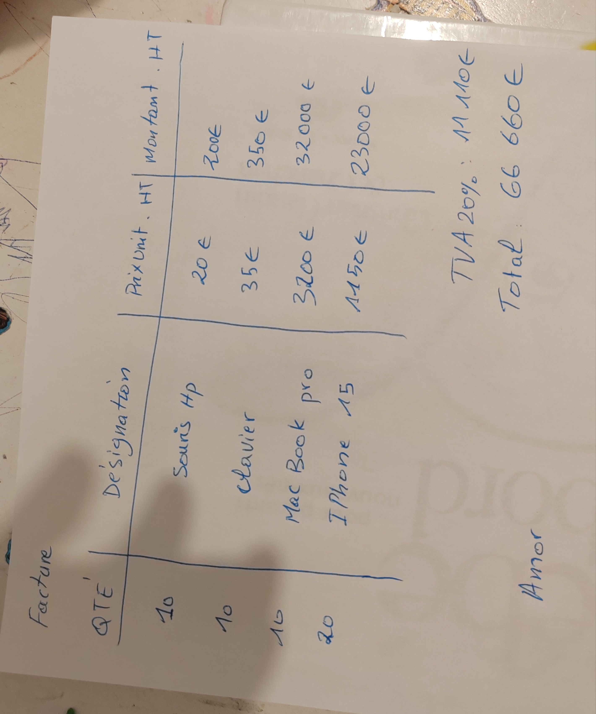
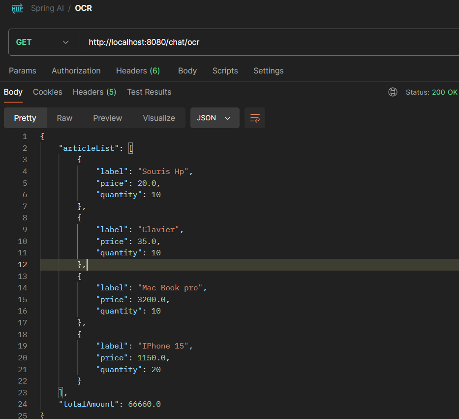

# Prompt Engineering & Spring AI

## Description
This application provides a REST API using Spring AI chat client to fetch information about World Cup winners, Spring Framework versions, and to analyze invoices.

## Importance of Structured Outputs
The ability of LLMs (Large Language Models) to produce structured outputs is critical for developers who need to quickly convert AI-generated results into data types such as JSON, XML, or Java Classes. This capability enables seamless integration with other functions and methods in applications.

## Example

With Spring API and OpenAI, reading a handwritten invoice and converting it into structured data can be done in a single line of code.
**It's absolutely Impressive!**

```java
var userMessage = new UserMessage(userMessageText, List.of(
    new Media(MimeTypeUtils.IMAGE_JPEG, imageResource)
));
var invoice = chatClient.prompt()
                        .messages(userMessage)
                        .call()
                        .entity(Invoice.class);
```

#### Input 


#### Output 



